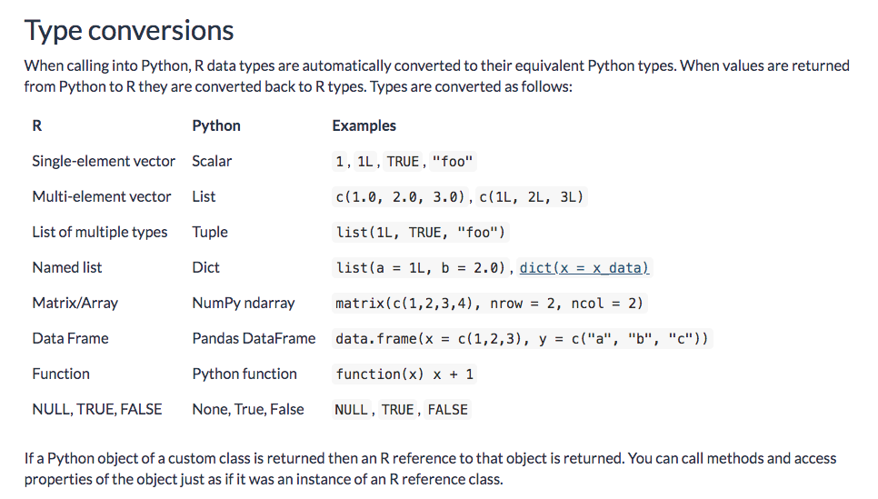

### Data Sci Paradigm


```{r setup, include = FALSE, message = FALSE}
knitr::opts_chunk$set(message = FALSE, warning = FALSE, comment = NA)
library(reticulate)
library(tidyverse)
library(lubridate)
library(plotly)
library(highcharter)
```

### Let's load some R packages

```{r, eval=FALSE}
knitr::opts_chunk$set(message = FALSE, warning = FALSE, comment = NA)
library(reticulate) # this is the package for passing R and python objects to/fro
library(tidyverse)
library(lubridate)
library(plotly)
library(highcharter)
```

### Let's load some Python libraries and define a function

```{python}
import pandas as pd
import numpy as np
import sklearn
import datetime
import janitor
from sklearn.linear_model import LinearRegression
from sklearn.model_selection import train_test_split


def predict(df, state_1_predictor, state_2_predictor, state_predicted, test_size):
    X = df[[state_1_predictor, state_2_predictor]]
    y = df[state_predicted]
    X_train, X_test, y_train, y_test = train_test_split(X, y, test_size = test_size, shuffle = False)
    model = LinearRegression()
    model.fit(X_train, y_train) 
    preds = model.predict(X_test)
    results = pd.DataFrame({'predicted':preds, 'actual':y_test})
    nrow = y_test.shape[0]
    results['date'] = df[-nrow:]['date'] 
    return(results)
```

### Data import/wrangle with pandas

```{python}
freddie = pd.read_excel("http://www.freddiemac.com/fmac-resources/research/docs/State_and_US_SA.xls", skiprows = 5, nrows = 532) # look up nrows

freddie['date'] = freddie['Month'].apply(lambda x:datetime.datetime.strptime(x,"%YM%m"))

freddie = janitor.clean_names(freddie)

freddie.drop(['month'], axis=1, inplace = True)

freddie = freddie[freddie['date'] > '1989-12-31']

freddie_tidy = pd.melt(freddie,
                       ["date"],
                       var_name = "location",
                       value_name = "hpi")
                       
freddie_tidy['sma'] = freddie_tidy.groupby('location')['hpi'].apply(lambda x:x.rolling(center=False,window=10).mean())

freddie_tidy['roll_sd'] = freddie_tidy.groupby('location')['hpi'].apply(lambda x:x.rolling(center=False,window=10).std())

freddie_tidy['roll_max'] = freddie_tidy.groupby('location')['hpi'].apply(lambda x:x.rolling(center=False,window=10).max())

freddie_tidy['roll_min'] = freddie_tidy.groupby('location')['hpi'].apply(lambda x:x.rolling(center=False,window=10).min())

print(freddie_tidy.head())                     
```

### Visualize with R, but first, how are these objects being passed



### To ggplot

```{r}
library(ggplot2)
roll_max_ggplot <- 
py$freddie_tidy %>% 
  na.omit() %>% 
  ggplot(aes(x = date, y = roll_max)) + 
  geom_line(color = "cornflowerblue")

roll_max_ggplot
```

```{r}
roll_max_ggplot +
  geom_line(aes(y = roll_min), color = "red")
```

```{r}
roll_max_ggplot +
  geom_line(aes(y = roll_min), color = "red") +
  facet_wrap(~location, ncol = 10)

```


```{r}
py$freddie_tidy %>% 
  ggplot(aes(x = date, y = roll_sd, color = location)) + 
  geom_line(key_glyph = "timeseries") +
  facet_wrap(~location, ncol = 10)
```
```{r}
py$freddie_tidy %>% 
filter(location == "ga" | location == "ny" | location == "ca") %>% 
  ggplot(aes(x = sma, 
             y = roll_sd, 
             color = location)) +
  theme_minimal() +
  geom_point(alpha = .5) +
  geom_smooth(method = "lm", se = TRUE, color = "purple", size = 1) +
  ylab("Housing Price Index") +
  xlab("hpi min") +
  facet_wrap(~location, nrow = 3)
```

```{r}
py$freddie_tidy %>% 
filter(location == "ga" | location == "ny" | location == "ca") %>% 
  ggplot(aes(x = sma)) +
  theme(axis.text.x = element_text(angle = 90, hjust = 1, vjust = 0.5)) +
  theme_minimal() +
  geom_histogram(color = "blue", fill = "pink", bins = 35) +
  ylab("Housing Price Index Smoothed") 
```


```{r}
py$freddie_tidy %>% 
  mutate(date = ymd(date)) %>% 
  hchart(., hcaes(x = date, y = roll_sd, group = location), type = 'line') %>% 
  hc_tooltip(pointFormat = "{point.location}: ${point.roll_sd: .2f}") %>% 
  hc_legend(enabled = FALSE)
```

### Switch back to python and use our predictive model, powerd by scikit

```{python}
predicted_house_price = predict(freddie, 'ga', 'fl', 'united_states_seasonally_adjusted', 0.1)

print(predicted_house_price.head())
```

### Back to R to visualize model results

```{r}
py$predicted_house_price %>% 
  gather(type, value, -date) %>% 
  ggplot(aes(x = date, y = value, color = type)) +
  geom_point() 

```

```{r}
ggplotly(
py$predicted_house_price %>% 
  gather(type, value, -date) %>% 
  ggplot(aes(x = date, y = value, color = type)) +
  geom_point() 
)
```

```{r}

py$predicted_house_price %>% 
  gather(type, value, -date) %>% 
  mutate(date = ymd(date)) %>% 
  hchart(., hcaes(x = date, y = value, group = type), type = "line")
```


